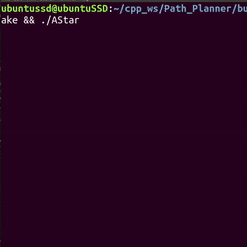
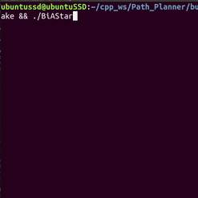
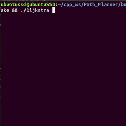
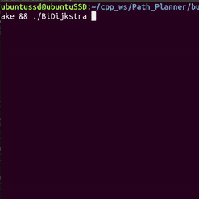
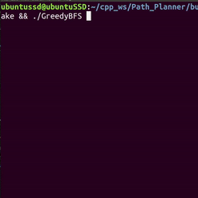

# Path-Planner-2D
C++ Implementation of Robotics 2D Path Planner Algorithms

## Structure
  One Base Implementation for Both Bidirectional or Unidirectional 2D Path Planner Algorithms.
  
    Base Code - "PathPlanner" folder
  
    Template Code - "template" folder
  
  
### Node Structure
    struct Node {
        // Coordinates/Pose of the Node
        int     x, y;

        // To store Cost and Pose Related Parameter
        map<string, double> costMap;
        map<string, bool>   nodeState;

        // Vector/List of Neighbours
        vector<Node*>   nodeNeighbours;

        // Parent Node of each node
        map<string, Node*> parents;
    };

### Class Structure

  #### Data Members
  
    // Planned Path List  
    list<Node*> plannedPath;

    // Map Dimensions
    int mapWidth    = 0;
    int mapHeight   = 0;

    // Meeting Node if Bidirectional
    Node *nodeMiddle = nullptr;

    // Nodes Array/Map
    Node *nodes = nullptr;

    // Start & Goal Nodes
    Node *nodeStart = nullptr;
    Node *nodeGoal = nullptr;

    // Whether Bidirectional or Unidirectional Algorithm
    bool isBidirectional = false;

  #### Constructors

    PathPlanner2D();

    // Constructor with 2D Map as input
    template <size_t width, size_t height>
    PathPlanner2D(int (&map2D)[width][height]);

  #### Member Functions

    // Function to set the Algorithm is Bidirectional or Unidirectional
    void setBidirectionalFlag(bool flag);

    // Function with 2D Map as input
    template <size_t width, size_t height>
    void updateMap(int (&map2D)[width][height]);

    // Functions to set Start and Goal Nodes 
    void setStartNode(int x, int y);
    void setGoalNode(int x, int y);

    // Function to start to plan path
    bool startPlan();

    // Function to retrieve the planned path
    void getPlannedPath(vector<Node*>& path);
    // Overridable Function to implement the different algorithm(By Default Empty)
    virtual bool setPlannedPath(Node *nodes, Node *Start, Node *Goal); 

    // Function to resst all the nodes to default state
    void resetNodes();
    // Function to print the map with ASCII Characters
    void printMap(vector<Node*> path);

## 2D Path Planner

  ### A* Star Algorithm
  

  ### A* Star Bidirectional Algorithm
  

  ### Dijkstra Algorithm
  

  ### Dijkstra Bidirectional Algorithm
  

  ### Greedy Best First Search Algorithm
  

## Usage
  1) cd (to cloned folder)
  2) mkdir build && cd build
  3) cmake ..
  4) make
  5) ./GreedyBFS.gif (or) ./BiDijkstra.gif (or) ./Dijkstra.gif (or) ./BiAstar.gif (or) ./AStar.gif
  
